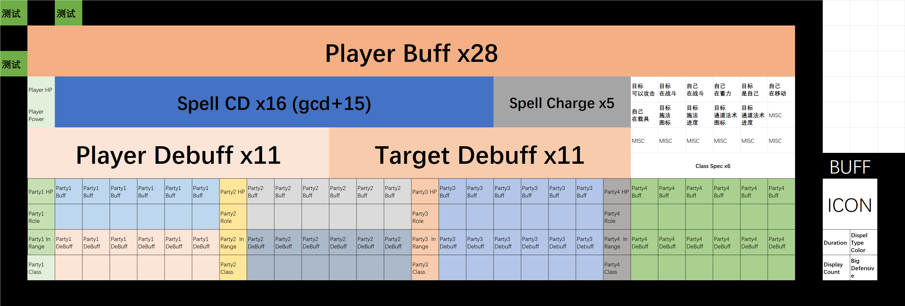

# MidnightAddon

贼心不死，继续奋斗

## 规划图

## 目前可以转化为色块的属性

- 玩家基础属性
  - 生命值的百分比
  - 能量条的百分比

- 增益
  - 无法获得指定某个增Buff/Debuff
  - 可以获取一组Buff/Debuff，获取过程可以过滤，可以限制数量、可以设置排序优先级。
  - 获取的Buff/Debuff中，下列属性可以转化为像素
    - 图标
    - 剩余时间的百分比：可以转化为渐变过程。从0到100%。
    - 层数：可以输出文字。
    - 可驱散类型：可以转化为不同颜色。
    - 是否是队友给的”大增益“

- 技能
  - 冷却时间百分比：可以将任意技能的冷却时间百分比转化为渐变过程。
  - 充能百分比：同上

- 施法状态
  - 施法技能的图标
  - 施法剩余时间
  - 施法是否可以被打断

- 一些其他状态
  - 某个单位是否可以被攻击
  - 某个单位是否在战斗
  - 其他单位的生命值、能量值。
  - 某个单位是否在蓄力。
  - 某个单位是否在移动。

- 小队属性
  - 职责：可以转化为不同颜色。
  - 职业：可以转化为不同颜色。
  - 上述所有的施法状态、增益、基础属性、其他状态。