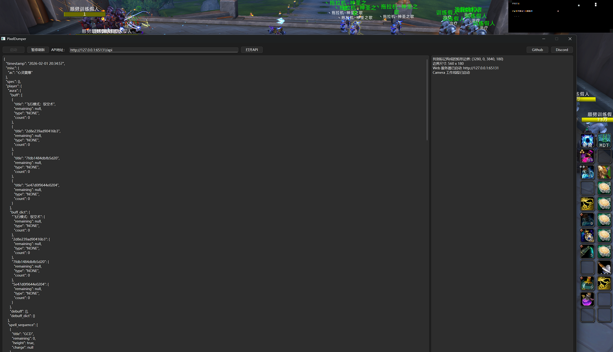

# WowPixelDumper 

**贼心不死，继续奋斗** 💪

一个用于《魔兽世界》（World of Warcraft）的**游戏数据像素化插件**，通过将游戏内的可收集信息转换为屏幕角落的像素点，让外部程序可以轻松读取并解析为结构化数据。

> ⚠️ **重要声明**：本项目仅为技术演示和思路参考，**请勿直接在正式游戏环境中使用**，否则可能导致账号封禁。项目旨在抛砖引玉，展示一种数据提取的思路，使用者需自行承担风险。

---

## 🧠 工具原理

通过游戏内置 API 将各类游戏信息（生命值、技能冷却、光环效果等）渲染为屏幕角落的一系列 **10×10 像素块**，每个像素块代表一种特定信息。外部 Python 程序通过屏幕捕获读取这些像素块，利用 NumPy 进行高效处理，最终输出结构化 JSON 数据或提供 Web API 服务。

**为什么用像素块？**  
- 易于被 `numpy` 读取为数组，避免复杂的图像识别和大模型计算
- 性能开销极低，适合高频率刷新
- 结构固定，解析逻辑简单可靠

---

## 🚀 目前已实现的功能

###  **玩家信息**
-  当前生命值百分比（精度 1%，若使用渐变块可达 1/255）
-  当前能量条百分比
-  伤害吸收盾占总生命值的百分比（精度 1%）
-  治疗吸收盾占总生命值的百分比（精度 1%）
-  是否在移动
-  是否在战斗中
-  是否在载具中
-  是否在施法/引导中
-  施法图标/引导图标
-  施法进度/引导进度

###  **技能信息**
-  技能图标
-  冷却/充能冷却时间
-  技能充能层数
-  是否高亮（技能可用提示）

###  **玩家光环（Buff/Debuff）信息**
-  光环图标
-  光环剩余时间百分比
-  光环可驱散类型（魔法、诅咒、疾病、中毒等）
-  光环层数

###  **目标/焦点信息**
-  目标生命值百分比
-  施法/引导图标
-  施法/引导进度
-  施法/引导是否可以打断
-  目标是否存在、可攻击、在范围内、存活等状态

###  **队友信息**（限于屏幕空间，仅支持小队）
-  当前生命值、吸收盾（精度同玩家）
-  适量光环信息（与玩家光环获取内容相同）

###  **其他信息**
-  辅助战斗提示图标
-  数字显示区域（用于调试和配置）

---

## 🖼️ 界面图例




---

## 📦 安装与使用

### 1. 插件安装
将本目录复制到魔兽世界客户端的 `Interface/AddOns/` 文件夹中，启动游戏后插件将自动加载。

### 2. Python 环境配置（Windows）

确保已安装 [uv](https://github.com/astral-sh/uv)（快速 Python 包管理器）：

```powershell
# 安装 uv
powershell -ExecutionPolicy ByPass -c "irm https://astral.sh/uv/install.ps1 | iex"

# 同步依赖
uv sync

# 运行主程序
uv run .\WowPixelDumper.py
```

---

## ⚠️ 免责声明⚠️

1. **切勿直接使用**：本项目的代码特征明显，如果大量用户使用完全相同的代码，极易被游戏反作弊系统检测并导致**账号封禁**。
2. **必须个性化修改**：强烈建议您根据自身需求对代码进行修改和定制。调整像素布局、数据结构或通信方式，使其具备独特性。
3. **抛砖引玉，非开箱即用**：本项目旨在展示“将游戏数据转换为像素块并通过外部程序解析”的技术思路，而非提供可直接投入使用的产品。
4. **自行承担全部风险**：任何基于本项目的二次开发、修改或使用行为，均由您自行承担一切后果（包括但不限于账号封禁、数据损失等）。
5. **禁止商用与损害公平**：不得将本项目用于任何商业用途，或开发损害游戏公平性的外挂/自动化工具。


